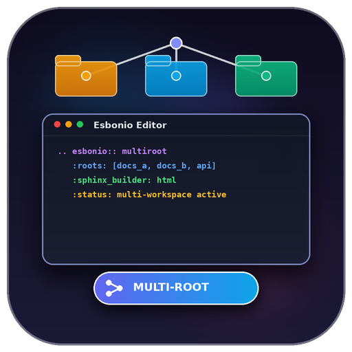
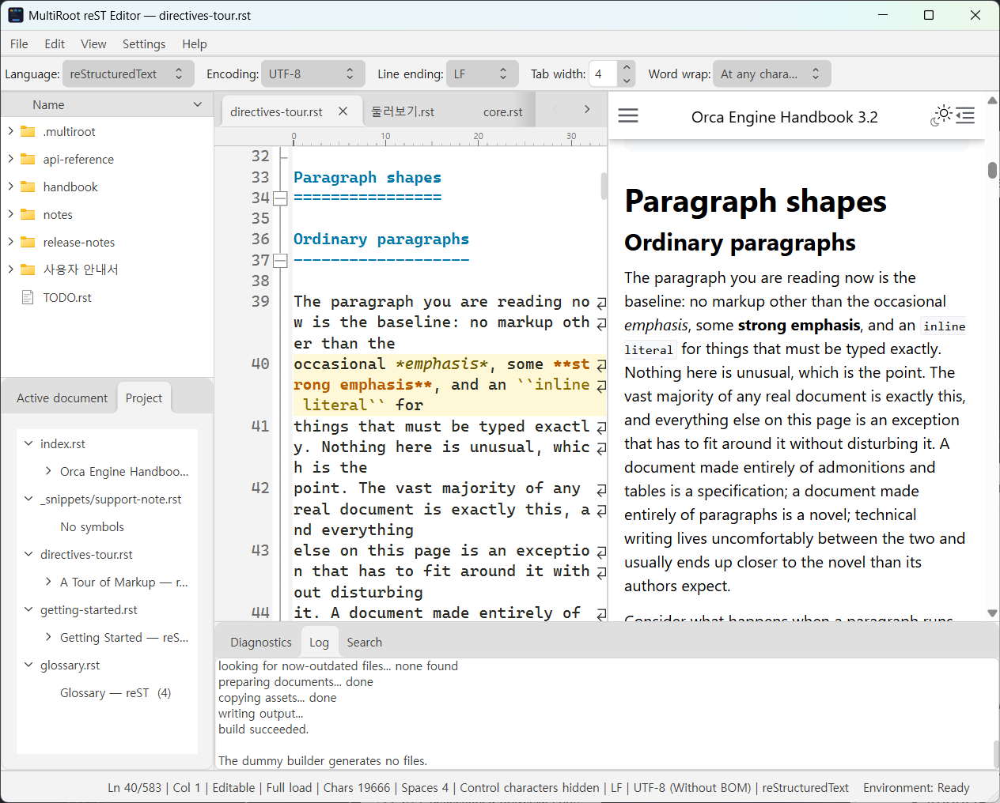
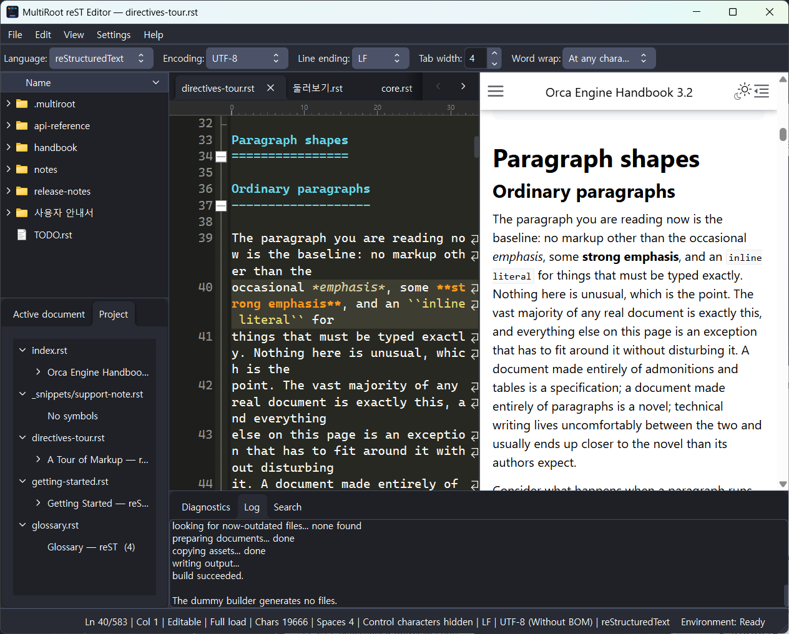
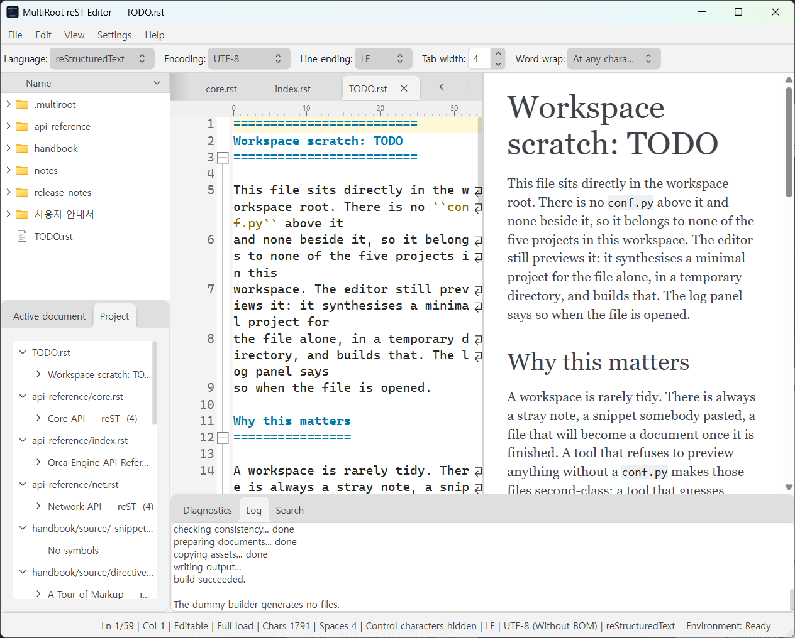
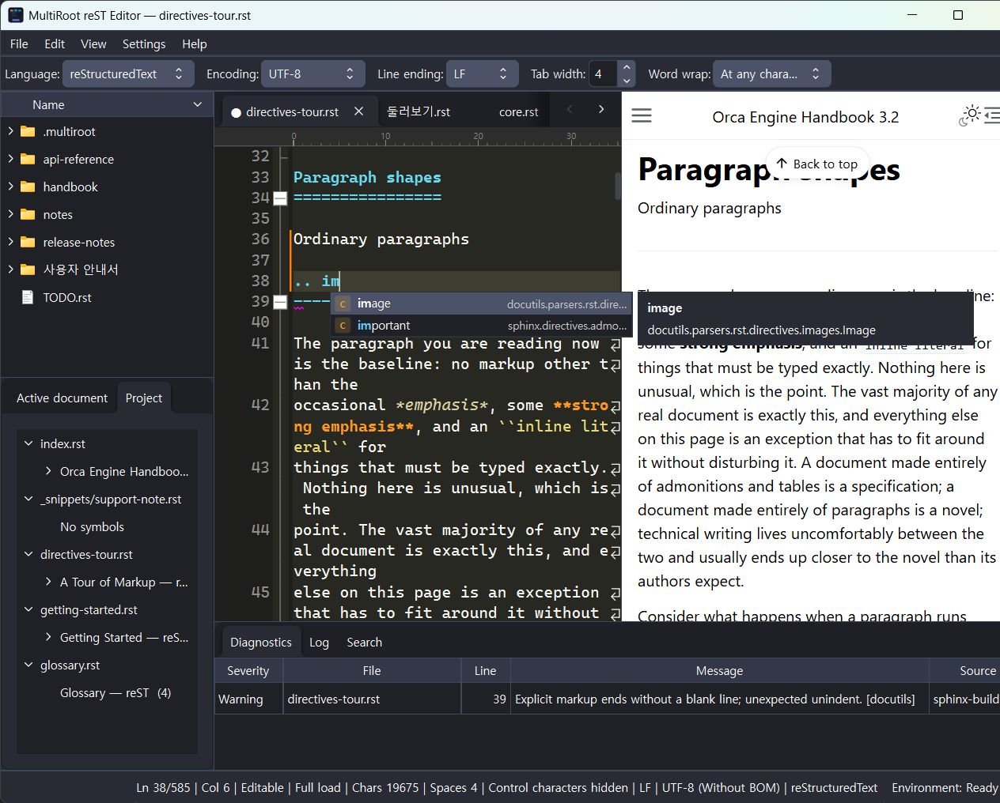
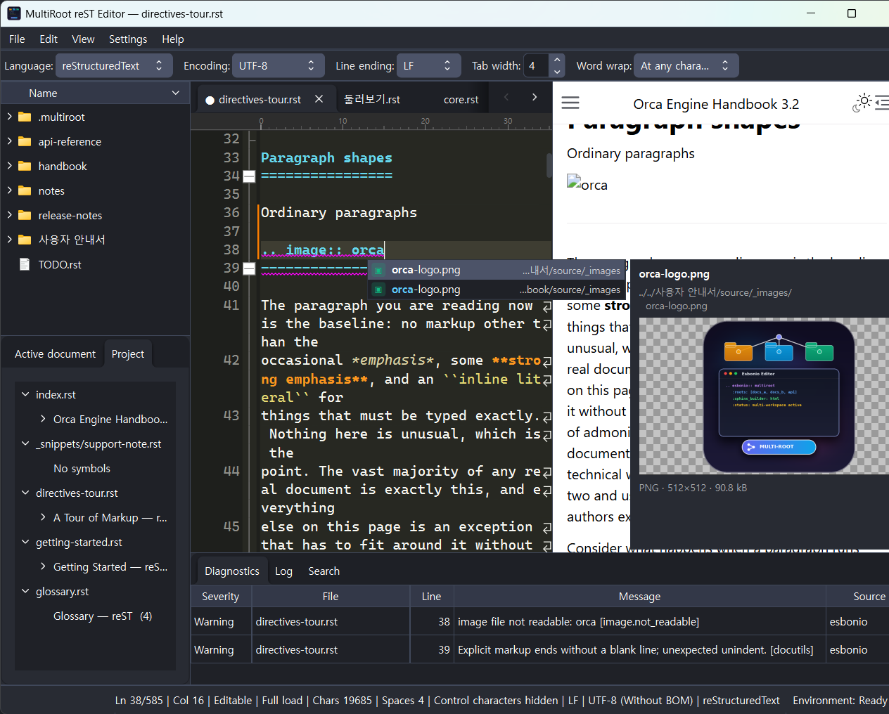
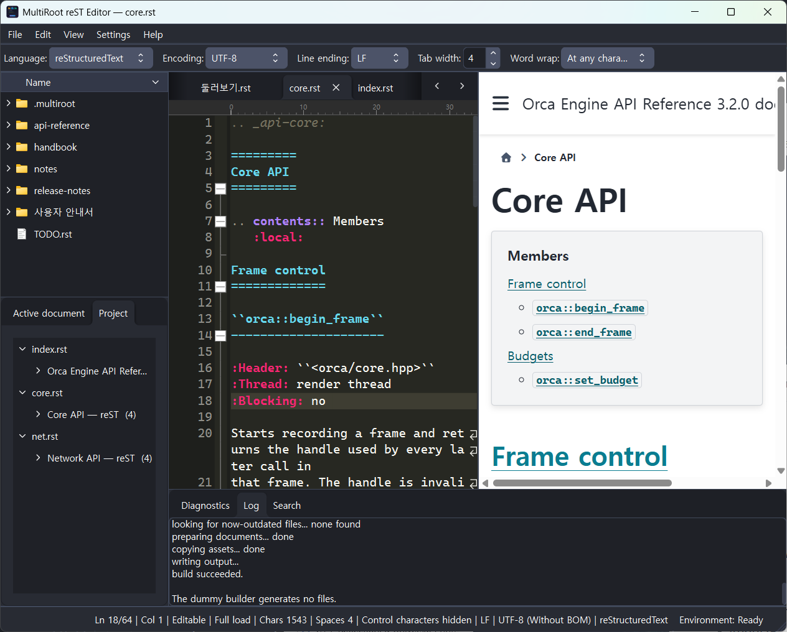

<div align="center">



# MultiRoot reST Editor

**A reStructuredText editor that maps every file to the right Sphinx project — even when a single folder holds several of them**

[](LICENSE)


[](https://github.com/jgh0721/MultiRootEsbonIo/releases)

[한국어](Readme.md) · [Changelog](History.md) · [Releases](https://github.com/jgh0721/MultiRootEsbonIo/releases)

</div>

---

## Why this exists

[esbonio](https://github.com/swyddfa/esbonio) is a good reStructuredText language server, but
it **does not expect one folder to contain several Sphinx projects.** Real working folders
usually look exactly like that.

```text
Root
    DocA
        conf.py
        index.rst
    DocB
        conf.py
        index.rst
    DocC
        source
            conf.py
            index.rst
    examples.rst        ← belongs to none of them
```

When you open a workspace, this editor finds every `conf.py` under it and builds a project
list. Opening a file then walks **upwards to the nearest project** and binds the file to it.
`DocC/source` being one level deeper changes nothing, and neither does `DocA` and `DocB`
sitting side by side. A file like `examples.rst`, which belongs to no project at all, gets a
**virtual project**: a minimal `conf.py` synthesised in a temporary directory so that the file
previews like any other.

The preview is not an approximation. It is **a real Sphinx build** driven by that project's own
`conf.py`, so the theme, the extensions and the cross references match what a full build produces.

## Screenshots

<table>
<tr>
<td width="50%"></td>
<td width="50%"></td>
</tr>
<tr>
<td align="center"><b>Light</b></td>
<td align="center"><b>Dark</b></td>
</tr>
</table>

> The workspace on screen is [`docs/demo/`](docs/demo) in this repository: five Sphinx projects
> plus three `.rst` files that belong to none of them.

## Features

### One workspace, many projects


Switching tabs changes how the preview looks entirely. No setting changed — **the project the
document belongs to did.** The three tabs in the clip above live in separate projects using
`furo`, `sphinx_rtd_theme` and `pydata_sphinx_theme` respectively.

- Every directory holding a `conf.py` is one project. Nested or side by side, both work
- Each project gets its own Esbonio server; the least recently used ones are retired (the cap is configurable)
- A standalone `.rst` / `.md` with no `conf.py` becomes a **virtual project** and behaves the
  same. The synthesised configuration lives in a temporary directory, so your folder stays clean



### Live preview with two-way scroll sync


Instead of jumping to a line number, both panes align **the line sitting at the same fraction
of the window height.** What you are reading stays in the middle on both sides, so the two do
not drift apart inside a long paragraph that each side wraps differently. Click a paragraph in
the preview and the editor jumps to that line.

- Unsaved edits show up in the preview (documents too expensive to re-parse are excluded by a time budget)
- Rebuilding the same document swaps only the body, so nothing flickers
- If the input is unchanged the build is skipped entirely. <kbd>F5</kbd> forces a rebuild
- Remote resources (CDN scripts and styles) can be switched off. With them off, such diagrams
  stay as **plain source text** rather than silently disappearing

### Completion


Esbonio returns nothing until its internal build finishes. So this editor **shows a built-in
table first and overwrites it once the language server answers.** It is usable immediately, and
a moment later it only offers what that project actually knows.

<table>
<tr>
<td width="50%"></td>
<td width="50%"></td>
</tr>
</table>

- 45 directives and 30 roles are built in, each with a description
- **Path completion** for slots that take a path, such as `.. image::`
  - Walks into directories one step at a time; understands `../` and Sphinx-absolute `/` paths
  - Knowing the file name is enough — it is found anywhere in the workspace. Duplicates are
    disambiguated with their relative path
  - Only extensions that fit the slot are offered (no `.rst` where an image belongs)
  - The side panel shows the full path, an **image preview**, and the format, dimensions and size
- Terms are harvested straight out of `.. glossary::` blocks and offered after `:term:`.
  Hovering a `:term:` reference in the body shows its definition
- The popup **never takes focus**, so you can keep typing while reading the list

### Syntax highlighting written for reStructuredText

Lexilla has no reStructuredText lexer, so this one is ours.

- Heading depth follows the docutils rule — the order in which each adornment character **first appears**
- Directive and role names are painted in **three states**: judgement is withheld until the
  language server supplies the vocabulary, and only then are known and unknown names separated.
  Nothing turns red the moment you open a file
- Folding is computed from two axes: section depth and indentation

### Markdown

`.md` files are first-class too — syntax highlighting, heading-based folding, the outline
tab, and a preview with the same two-way scroll sync.

- **The preview is drawn by a converter built into the program.** It appears before the Python
  environment is ready, follows your typing immediately, and writes nothing to disk
- Tables, task lists, strikethrough and autolinks (GFM), footnotes, YAML front matter,
  and GitHub alert boxes (`> [!NOTE]`)
- Math is rendered with KaTeX and diagrams with mermaid. Both are fetched from the internet,
  so the remote-resources setting above must be on — the same rule as the reStructuredText preview
- A `.md` file in a Sphinx project with `myst-parser` enabled is built **by Sphinx itself**, so it
  keeps that project's theme, extensions, and cross references

### Diagnostics, outline, workspace search



- **Diagnostics** — findings from the language server and from the Sphinx build, merged and deduplicated into one table
- **Outline** — the active document and the whole project, side by side. A regex pass draws it immediately if the server is slow
- **Search** — find and replace across the workspace, previewed as a **real unified diff**, applied only to the files you confirmed

### The ordinary editor things

Encoding detection with BOM and line-ending control, a limited mode for very large files, hot
exit that keeps unsaved changes in the background, a column ruler, indentation guides, brace
matching, change-history markers, and four word-wrap modes.

When another program changes a file you have open — a build script, `git checkout`, another
editor — the editor notices and reloads it. A tab with unsaved edits is asked about first.
Settings → Text viewer picks between ignoring, reloading automatically, and asking; on network
drives that never send notifications you can switch to polling.

### Themes and languages

Light and dark, switched from **View → Toggle theme**, and the Windows title bar follows along.
Individual colours can be edited in the settings and exported or imported as JSON.

Korean, English and Japanese, switched **without restarting** (Settings → General → Display language).

## Installing

1. Download the ZIP from [Releases](https://github.com/jgh0721/MultiRootEsbonIo/releases) and unpack it anywhere
2. Run `MultiRoot-reST Editor.exe`

There is no installer. Nothing is written to the registry, and settings live next to the
executable in `MultiRoot-reST Editor.ini`. Deleting the folder removes everything.

**You do not need Python or Sphinx beforehand.** On first run the bundled `uv` builds a Python
runtime with Sphinx and Esbonio into `Environment/` next to the executable. **The application
does not wait for it** — it starts immediately, and the preview switches on once the status-bar
environment chip says it is ready.

New versions are detected in the background and announced in a bar; the download starts only
when you ask for it. The archive is verified by hash, signature and version before a separate
updater closes the app and replaces the files.

> **If you are on 0.3.1 or earlier, the automatic update will not reach you.** The executable
> was renamed in 0.4.0. Download the full package from Releases and unpack it over the same
> folder; your settings carry over. The reasoning is in the [changelog](History.md).

## Using it

**File → Open workspace** (<kbd>Ctrl</kbd>+<kbd>O</kbd>) and pick the **parent folder** that
contains the projects — not an individual project.

The command line works too. If the first argument is a directory it becomes the workspace; if
it is a file, its parent directory does.

```powershell
"MultiRoot-reST Editor.exe" D:\docs D:\docs\guide\index.rst
```

Open tabs, caret positions and pane sizes are kept per workspace in `.multiroot/workspace.json`
and restored on the next run.

| Shortcut | Action |
|---|---|
| <kbd>Ctrl</kbd>+<kbd>O</kbd> | Open workspace |
| <kbd>Ctrl</kbd>+<kbd>Space</kbd> | Completion |
| <kbd>F5</kbd> | Rebuild preview |
| <kbd>Ctrl</kbd>+<kbd>F</kbd> / <kbd>Ctrl</kbd>+<kbd>H</kbd> | Find / Replace |
| <kbd>F3</kbd> / <kbd>Shift</kbd>+<kbd>F3</kbd> | Find next / previous |
| <kbd>Ctrl</kbd>+<kbd>G</kbd> | Go to line |
| <kbd>Alt</kbd>+<kbd>Z</kbd> | Toggle word wrap |
| <kbd>Ctrl</kbd>+<kbd>Shift</kbd>+<kbd>-</kbd> / <kbd>+</kbd> | Fold / unfold all |
| <kbd>Ctrl</kbd>+<kbd>I</kbd> | Settings |

Shortcuts are rebindable in Settings → Shortcuts.

## Building from source

Windows x64, Visual Studio 2022 (MSVC v143), Qt 6.11.1 and CMake 3.28 or newer. Scintilla,
Lexilla and Qlementine are fetched at configure time via `FetchContent`, so the first configure
needs network access.

```powershell
cmake --preset RelWithDebInfo
cmake --build --preset RelWithDebInfo
```

To build the tests as well, use the `Debug-Tests` preset (`MRST_BUILD_TESTS=ON`).

```powershell
cmake --preset Debug-Tests
cmake --build --preset Debug-Tests
ctest --preset Debug-Tests
```

## Around the repository

| Path | What it is |
|---|---|
| [`docs/demo/`](docs/demo) | The demo workspace used for the screenshots and clips: five projects plus three unowned `.rst` files |
| [`tools/demo/`](tools/demo) | The script that retakes those captures |
| [`docs/RELEASE.md`](docs/RELEASE.md) | Release procedure |
| [`docs/I18N.md`](docs/I18N.md) | Translation procedure |
| [`History.md`](History.md) | Changelog (Korean) |

## License

[MIT](LICENSE).

This program uses [Qt](https://www.qt.io/) (LGPLv3),
[Scintilla](https://www.scintilla.org/) and [Lexilla](https://www.scintilla.org/Lexilla.html),
[Qlementine](https://github.com/oclero/qlementine) (MIT),
[markdown-it](https://github.com/markdown-it/markdown-it) and [markdown-it-footnote](https://github.com/markdown-it/markdown-it-footnote) (MIT),
[Sphinx](https://www.sphinx-doc.org/) and [docutils](https://docutils.sourceforge.io/),
[Esbonio](https://github.com/swyddfa/esbonio), and [uv](https://github.com/astral-sh/uv).

※ This project was written with the help of AI.
