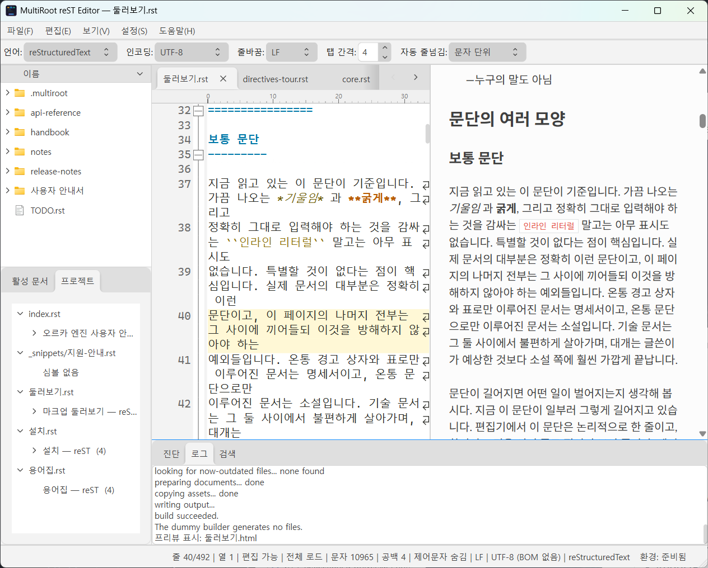
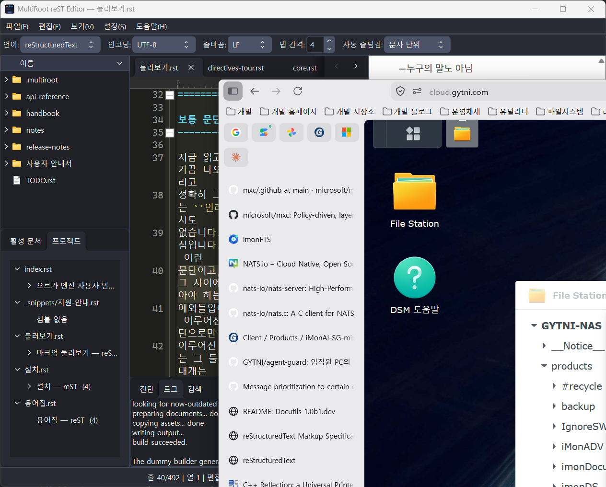
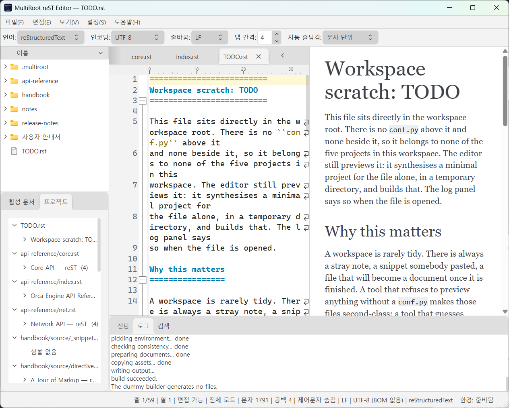
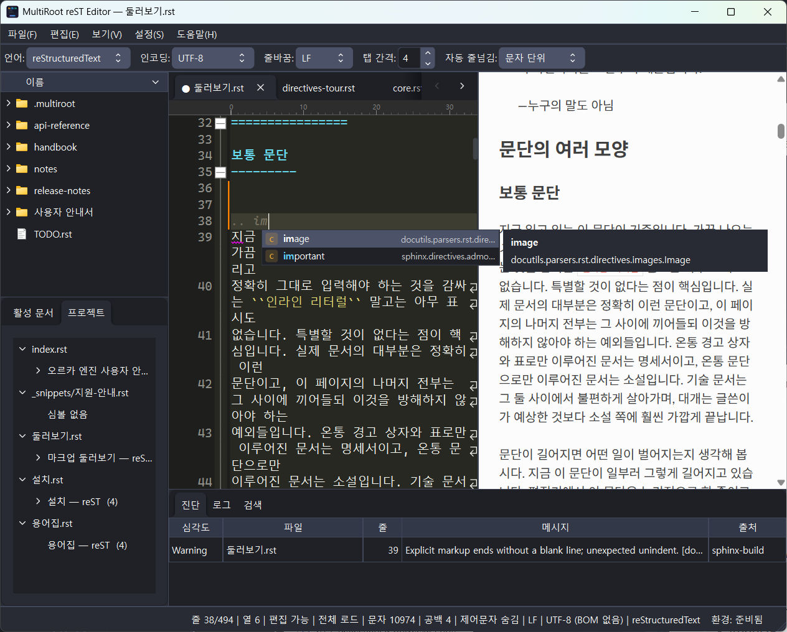
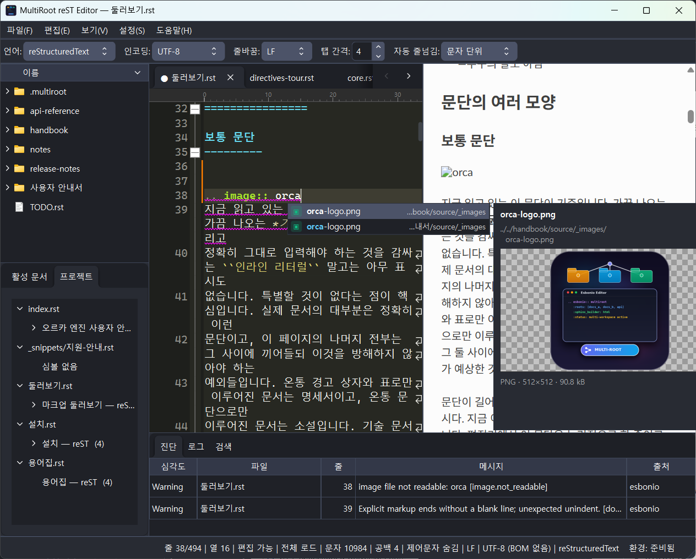
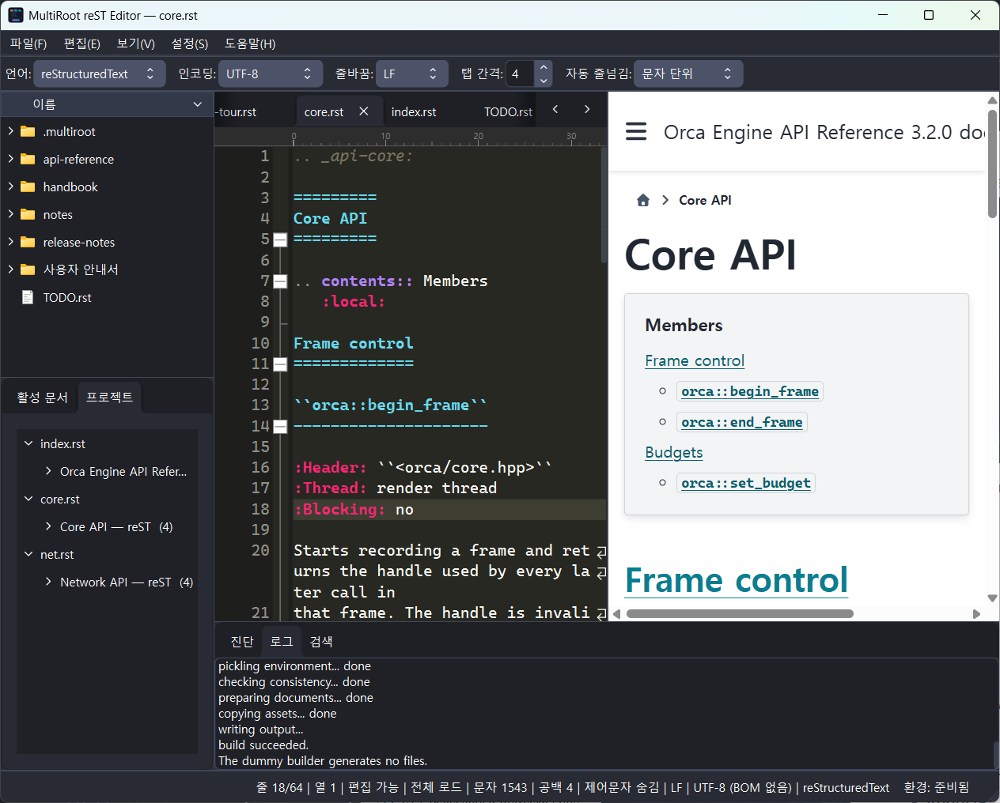

<div align="center">


# MultiRoot reST Editor

**한 폴더 안에 Sphinx 프로젝트가 여럿 있어도, 파일마다 제 프로젝트를 찾아 주는 reStructuredText 편집기**

[](LICENSE)


[](https://github.com/jgh0721/MultiRootEsbonIo/releases)

[English](Readme.en.md) · [발자취](History.md) · [릴리스](https://github.com/jgh0721/MultiRootEsbonIo/releases)

</div>

---

## 왜 만들었나

[esbonio](https://github.com/swyddfa/esbonio) 는 좋은 reStructuredText 언어 서버지만,
**한 폴더 안에 Sphinx 프로젝트가 여러 개 있는 상황을 상정하지 않았습니다.** 그런데 실제
작업 폴더는 대개 그런 모양입니다.

```text
Root
    DocA
        conf.py
        index.rst
    DocB
        conf.py
        index.rst
    DocC
        source
            conf.py
            index.rst
    examples.rst        ← 어느 프로젝트에도 속하지 않는다
```

이 편집기는 워크스페이스를 열 때 `conf.py` 를 모두 찾아 프로젝트 목록을 만들고, 파일을
열 때마다 **위로 거슬러 올라가며 가장 가까운 프로젝트**에 붙입니다. `DocC/source` 처럼
한 단계 더 들어가 있어도, `DocA` 와 `DocB` 가 나란히 있어도 결과는 같습니다. 그리고 어느
프로젝트에도 속하지 않는 `examples.rst` 는 **가상 프로젝트**로 처리해, 최소한의 `conf.py`
를 임시 디렉터리에 만들어 똑같이 프리뷰합니다.

프리뷰는 흉내가 아니라 **진짜 Sphinx 빌드**입니다. 그 프로젝트의 `conf.py` 를 그대로 써서
빌드하므로 테마도, 확장도, 상호 참조도 실제 산출물과 같습니다.

## 화면

<table>
<tr>
<td width="50%"></td>
<td width="50%"></td>
</tr>
<tr>
<td align="center"><b>라이트</b></td>
<td align="center"><b>다크</b></td>
</tr>
</table>

> 화면에 보이는 워크스페이스는 이 저장소의 [`docs/demo/`](docs/demo) 입니다. Sphinx 프로젝트
> 5개와, 어디에도 속하지 않는 `.rst` 3개로 이루어져 있습니다.

## 주요 기능

### 한 워크스페이스, 여러 프로젝트


탭을 옮기면 프리뷰의 겉모습이 통째로 바뀝니다. 설정이 바뀐 것이 아니라 **문서가 속한
프로젝트가 바뀐 것**입니다. 위 영상의 세 탭은 각각 `furo`, `sphinx_rtd_theme`,
`pydata_sphinx_theme` 를 쓰는 별개의 프로젝트에 속해 있습니다.

- `conf.py` 가 있는 자리마다 프로젝트 하나. 중첩되어 있어도, 형제로 나란히 있어도 됩니다
- 프로젝트마다 Esbonio 서버를 따로 띄우고, 오래 쓰지 않은 것부터 정리합니다(최대 개수 설정 가능)
- `conf.py` 가 없는 단독 `.rst` / `.md` 는 **가상 프로젝트**로 만들어 동일하게 지원합니다.
  임시 디렉터리에 최소 설정을 합성하므로 작업 폴더가 더러워지지 않습니다



### 라이브 프리뷰와 양방향 스크롤 동기화


"몇 번째 줄로 이동" 이 아니라 **창 높이의 같은 비율 자리를 맞춥니다.** 지금 읽고 있는
지점이 양쪽 모두 창 한가운데에 머물기 때문에, 한 줄이 열 줄로 접히는 긴 문단 안에서도
어긋나지 않습니다. 프리뷰의 문단을 누르면 편집기가 그 줄로 갑니다.

- 저장하지 않은 편집도 프리뷰에 반영합니다(재파싱에 오래 걸리는 문서는 시간 예산으로 걸러 냅니다)
- 같은 문서를 다시 빌드할 때는 본문만 갈아 끼워 깜빡이지 않습니다
- 입력이 그대로면 빌드를 통째로 건너뜁니다. 강제로 다시 만들려면 <kbd>F5</kbd>
- 원격 리소스(CDN 스크립트·스타일)는 설정에서 끌 수 있습니다. 끄면 그런 도표는 조용히
  사라지는 대신 **원본 텍스트 그대로** 남습니다

### 자동완성


Esbonio 는 내부 빌드가 끝나기 전에는 빈 결과를 돌려줍니다. 그래서 이 편집기는 **내장 표를
먼저 띄우고, 언어 서버의 답이 오면 덮어씁니다.** 켜자마자 쓸 수 있고, 잠시 뒤부터는 그
프로젝트가 실제로 아는 것만 나옵니다.

<table>
<tr>
<td width="50%"></td>
<td width="50%"></td>
</tr>
</table>

- 지시어 45종·롤 30종을 한국어 설명과 함께 내장하고 있습니다
- **경로 자동완성** — `.. image::` 처럼 경로를 받는 자리에서 파일을 찾아 줍니다
  - 디렉터리를 한 단계씩 따라 들어가고, `../` 와 `/` 로 시작하는 Sphinx 절대 경로를 모두 씁니다
  - 이름만 알면 워크스페이스 어디에 있든 찾습니다. 같은 이름이 여럿이면 상대 경로를 함께 보여 줍니다
  - 자리에 맞는 확장자만 제안합니다(이미지 자리에 `.rst` 를 올리지 않습니다)
  - 오른쪽 패널에 전체 경로와 **이미지 미리보기**, 형식·치수·크기가 나옵니다
- `.. glossary::` 안의 용어를 그대로 수확해 `:term:` 후보로 씁니다. 본문의 `:term:` 위에
  마우스를 올리면 정의가 뜹니다
- 팝업은 **포커스를 가져가지 않습니다.** 목록을 보면서 계속 칠 수 있습니다

### reStructuredText 전용 구문 강조

Lexilla 에는 reStructuredText 렉서가 없어서 직접 만들었습니다.

- 제목 깊이를 docutils 규칙대로(장식 문자가 **처음 나온 순서**) 셉니다
- 지시어·롤 이름을 **세 상태**로 칠합니다 — 언어 서버가 아직 목록을 주기 전에는 판단을
  보류하고, 목록이 오면 아는 것과 모르는 것을 나눕니다. 켜자마자 온 화면이 빨개지는 일이 없습니다
- 섹션 깊이와 들여쓰기 두 축으로 접기를 계산합니다

### Markdown

`.md` 도 reStructuredText 와 같은 등급으로 다룹니다 — 구문 강조, 제목 단위 접기,
개요 탭, 양방향 스크롤 동기화 프리뷰.

- **프리뷰는 프로그램에 내장된 변환기가 그립니다.** 파이썬 환경이 준비되기 전에도 바로 뜨고,
  타이핑하면 곧바로 반영됩니다. 디스크에 아무것도 쓰지 않습니다
- 표·작업 목록·취소선·자동 링크(GFM), 각주, YAML front matter,
  GitHub 경고 상자(`> [!NOTE]`)를 지원합니다
- 수식은 KaTeX, 다이어그램은 mermaid 로 그립니다. 둘 다 인터넷에서 받아오므로 위의 원격
  리소스 설정이 켜져 있어야 합니다 — reStructuredText 프리뷰와 같은 규칙입니다
- `myst-parser` 를 켠 Sphinx 프로젝트의 `.md` 는 그 프로젝트의 테마·확장·상호 참조를
  그대로 쓰도록 **실제 Sphinx 빌드로** 그립니다

### 진단 · 개요 · 워크스페이스 검색



- **진단** — 언어 서버와 Sphinx 빌드에서 나온 것을 합치고 중복을 접어 한 표로 보여 줍니다
- **개요** — 활성 문서와 프로젝트 전체를 각각. 언어 서버가 늦어도 정규식으로 먼저 그립니다
- **검색** — 워크스페이스 전체에서 찾고 바꿉니다. 바꾸기 전에 **진짜 unified diff** 로 보여 주고,
  확인한 파일에만 적용합니다

### 편집기 기본기

인코딩 자동 감지와 BOM·개행 제어, 대용량 파일 제한 모드, 저장하지 않은 변경을 백그라운드로
남겨 두는 핫 엑시트, 열 눈금자, 들여쓰기 가이드, 괄호 강조, 수정 내역 마커, 네 가지 자동
줄넘김 모드.

열어 둔 파일을 다른 프로그램(빌드 스크립트, `git checkout`, 다른 편집기)이 바꾸면 알아채고
다시 불러옵니다. 저장하지 않은 편집이 있는 탭은 먼저 묻습니다. 설정 → 텍스트 뷰어에서
무시 / 자동 불러오기 / 사용자에게 묻기 중 고르고, 알림이 오지 않는 네트워크 드라이브에서는
폴링으로 바꿀 수 있습니다.

### 테마와 언어

라이트/다크 테마를 **보기 → 테마 전환** 으로 바꿉니다. Windows 제목 표시줄까지 따라옵니다.
색은 설정에서 항목별로 바꾸고 JSON 으로 주고받을 수 있습니다.

한국어·영어·일본어를 지원하며 **재시작 없이** 바뀝니다(설정 → 공통 → 표시 언어).

## 설치

1. [릴리스](https://github.com/jgh0721/MultiRootEsbonIo/releases)에서 ZIP 을 받아 원하는 폴더에 풉니다
2. `MultiRoot-reST Editor.exe` 를 실행합니다

설치 관리자가 없습니다. 레지스트리에 남기는 것도 없고, 설정은 실행 파일 옆
`MultiRoot-reST Editor.ini` 에 들어갑니다. 폴더를 지우면 그것으로 끝입니다.

**Python 이나 Sphinx 를 미리 깔지 않아도 됩니다.** 처음 실행할 때 내장 `uv` 로 실행 파일 옆
`Environment/` 에 파이썬 런타임과 Sphinx·Esbonio 를 스스로 만듭니다. 수백 MB 를 받는 동안에도
**앱은 기다리지 않고 바로 뜹니다.** 준비가 끝나면 상태 표시줄의 환경 칩이 바뀌고 프리뷰가 켜집니다.

새 버전은 앱이 스스로 확인해 알려 주고, 받는 것은 누를 때만 시작합니다. 서명과 버전을 검증한
뒤 별도 업데이터가 앱을 닫고 파일을 바꿉니다.

> **0.3.1 이하를 쓰고 있다면 자동 업데이트가 오지 않습니다.** 0.4.0 에서 실행 파일 이름이
> 바뀌었기 때문입니다. 릴리스에서 전체 패키지를 받아 같은 폴더에 풀어 주세요. 설정은 그대로
> 이어집니다. 자세한 사정은 [발자취](History.md)에 적어 두었습니다.

## 사용법

**파일 → 워크스페이스 열기**(<kbd>Ctrl</kbd>+<kbd>O</kbd>)로 프로젝트들이 들어 있는 **상위 폴더**를
고릅니다. 프로젝트 하나하나가 아니라 그것들을 담고 있는 폴더입니다.

명령줄로도 됩니다. 첫 인자가 폴더면 워크스페이스, 파일이면 그 상위 폴더가 워크스페이스가 됩니다.

```powershell
"MultiRoot-reST Editor.exe" D:\docs D:\docs\guide\index.rst
```

열린 탭·캐럿 위치·화면 배치는 워크스페이스마다 `.multiroot/workspace.json` 에 남아 다음 실행에
복원됩니다.

| 단축키 | 하는 일 |
|---|---|
| <kbd>Ctrl</kbd>+<kbd>O</kbd> | 워크스페이스 열기 |
| <kbd>Ctrl</kbd>+<kbd>Space</kbd> | 자동 완성 |
| <kbd>F5</kbd> | 프리뷰 다시 빌드 |
| <kbd>Ctrl</kbd>+<kbd>F</kbd> / <kbd>Ctrl</kbd>+<kbd>H</kbd> | 찾기 / 바꾸기 |
| <kbd>F3</kbd> / <kbd>Shift</kbd>+<kbd>F3</kbd> | 다음 / 이전 찾기 |
| <kbd>Ctrl</kbd>+<kbd>G</kbd> | 줄 이동 |
| <kbd>Alt</kbd>+<kbd>Z</kbd> | 자동 줄넘김 켜고 끄기 |
| <kbd>Ctrl</kbd>+<kbd>Shift</kbd>+<kbd>-</kbd> / <kbd>+</kbd> | 모두 접기 / 펼치기 |
| <kbd>Ctrl</kbd>+<kbd>I</kbd> | 설정 |

단축키는 설정 → 단축키에서 바꿀 수 있습니다.

## 직접 빌드하기

Windows x64, Visual Studio 2022(MSVC v143), Qt 6.11.1, CMake 3.28 이상이 필요합니다.
Scintilla·Lexilla·Qlementine 은 구성할 때 `FetchContent` 로 받으므로 최초 구성에는 네트워크가 필요합니다.

```powershell
cmake --preset RelWithDebInfo
cmake --build --preset RelWithDebInfo
```

테스트를 함께 빌드하려면 `Debug-Tests` 프리셋을 씁니다(`MRST_BUILD_TESTS=ON`).

```powershell
cmake --preset Debug-Tests
cmake --build --preset Debug-Tests
ctest --preset Debug-Tests
```

## 저장소 안내

| 경로 | 내용 |
|---|---|
| [`docs/demo/`](docs/demo) | 스크린샷과 영상을 찍는 데 쓰는 데모 워크스페이스. 프로젝트 5개 + 소속 없는 `.rst` 3개 |
| [`tools/demo/`](tools/demo) | 그 화면을 다시 찍는 스크립트 |
| [`docs/RELEASE.md`](docs/RELEASE.md) | 릴리스 절차 |
| [`docs/I18N.md`](docs/I18N.md) | 번역 절차 |
| [`History.md`](History.md) | 발자취 |

## 라이선스

[MIT](LICENSE).

이 프로그램은 다음을 씁니다 — [Qt](https://www.qt.io/) (LGPLv3),
[Scintilla](https://www.scintilla.org/) · [Lexilla](https://www.scintilla.org/Lexilla.html),
[Qlementine](https://github.com/oclero/qlementine) (MIT),
[markdown-it](https://github.com/markdown-it/markdown-it) · [markdown-it-footnote](https://github.com/markdown-it/markdown-it-footnote) (MIT),
[Sphinx](https://www.sphinx-doc.org/) · [docutils](https://docutils.sourceforge.io/),
[Esbonio](https://github.com/swyddfa/esbonio), [uv](https://github.com/astral-sh/uv).

※ 이 프로젝트는 AI 를 사용하여 작성되었습니다.
